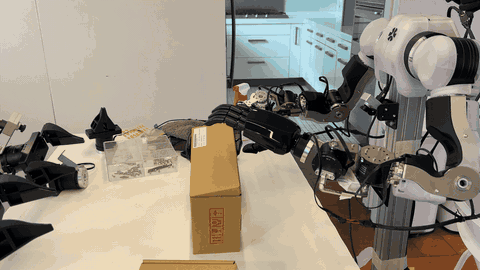
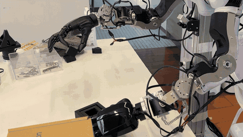
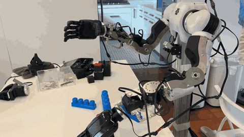
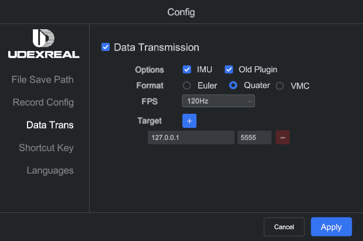

# Anvil-Prehensile

An end-to-end teleoperation stack for dexterous manipulation, bridging the
**UDCap**/**Wuji** glove and the **REALHAND L6** hand. Both sides are normalized
to the same `(21, 3)` MediaPipe-order keypoint frame; everything downstream of
that seam shares one code path.

Below are some demo videos that Anvil-Prehensile integrated with our OpenArm
system:

<table>
  <tr>
    <td width="33%"></td>
    <td width="33%"></td>
    <td width="33%"></td>
  </tr>
  <tr align="center">
    <td><b>Logistic packing</b></td>
    <td><b>Cube inserting</b></td>
    <td><b>Lego stacking</b></td>
  </tr>
  <tr align="center">
    <td>Open the deliver box, put items inside, then close it. </td>
    <td>Insert one cube into the other.</td>
    <td>Stack lego on top of each other. </td>
  </tr>
</table>

## Install packages & offline check

```bash
uv sync
uv run python -m prehensile.offline_check   # glove-free environment check
```

If `offline_check` fails, the environment is broken — stop there, it is not the
glove.

## Bring-up

Before running the prehensile teleoperation commands, follow the instructions
and links below to start the glove and hand hardware.

### 1 · Glove — pick one

#### **UDCap Data Glove**

Download **HandDriver**
([download](https://drive.google.com/drive/folders/1g4cA-hjEnTmQNcY6zyK04Bo9R_qfPcOC),
[guide](https://udexreal.gitbook.io/udexreal-docs/robotics/usage-for-udexreal-robotics-products#id-3.-udexreal-robotics-teleoperation-system)).
Under **Config → Data Trans**, set Data Transmission **ON**, Format **Quater**,
FPS **120**, Target `127.0.0.1:5555`:



#### **Wuji Glove**

Calibrate the glove first in **Wuji Studio**
([calibration guide](https://docs.wuji.tech/docs/en/wuji-studio/latest/calibration/),
[install](https://docs.wuji.tech/docs/en/wuji-studio/latest/installation/)).
Create a **named profile** before you calibrate — the built-in `Default` profile
does not persist results, so calibrating under it silently changes nothing and
the SDK keeps falling back to a generic hand URDF.

Note: close Wuji Studio before running prehensile teleop — only one session may
talk to the glove at a time.

### 2 · Hand (REALHAND L6)

Plug the USB adapter into the computer, then run the script below to set up the
udev rule:

```bash
sudo python3 tools/bring_up_hand.py
```

Every tool here defaults to a canonical interface name (`hand_l`/`hand_r`)
rather than probing, and udev gives hand adapters no name — so those names exist
only after this runs, and not across a reboot or replug.

## Commands

| command | purpose | hand move? |
| ------- | ------- | :-: |
| `uv run python -m prehensile.offline_check` | synthetic smoke test. No flags, left hand hardcoded. | no |
| `uv run python tools/probe_udp.py --seconds 2` | check the UDCap stream: expect ~120 pkt/s and a `verdict:` naming `TeleopDataQuat` or `JSON`. | no |
| `uv run python -m prehensile.teleop` | glove → angles, printed. No CAN is opened; `realhand` is never imported. | no |
| `uv run python -m prehensile.viz` | MuJoCo preview with keypoints overlaid. Needs a display. | no |
| `uv run python -m prehensile.teleop --live --speed 25` | drives the L6 | $\color{red}{\textsf{yes}}$ |

### Special setting for UDCap

`bButton` (UDCap only) toggles the grasp lock, in dry-run too. Locked channels
keep displaying the *tracked* value, not the frozen one being sent, and are
named in the trailing bracket:

```
thumb_flex=100.0  thumb_abd= 47.1  index= 12.0  middle= 88.4 ...  [PARKED thumb_abd  COUPLED thumb_flex<-index  FLOOR index=20]
```

## Flags

`T` = `teleop`, `V` = `viz`. Shared by both:

| flag | T | V | default | what it does | hand move? |
| ---- | :-: | :-: | ------- | ------------ | :-: |
| `--glove {udcap,wuji}` | ● | ● | `udcap` | glove source | no |
| `--hand {left,right}` | ● | ● | `left` | URDF, retarget config, L6 side, default interface | no |
| `--map {curl,retarget}` | ● | ● | `curl` | direct curl map, or the optimizer | no |
| `--fps N` | ● | ● | `60.0` | loop rate (console readout is throttled to ~12 Hz separately) | no |
| `--port N` | ● | ● | `5555` | UDP port; ignored for Wuji | no |

Specific to one command:

| flag | T | V | default | what it does | hand move? |
| ---- | :-: | :-: | ------- | ------------ | :-: |
| `--live` | ● | | off | open the L6 and send the angles | $\color{red}{\textsf{yes}}$ |
| `--interface IFACE` | ● | | from `--hand` (`hand_l`/`hand_r`) | which physical hand receives commands | $\color{red}{\textsf{yes}}$ |
| `--speed N` | ● | | `40.0` | motor speed 0–100, set once at startup. Motors do not move at 0. | $\color{red}{\textsf{yes}}$ |
| `--no-keypoints` | | ● | off | hide the keypoint overlay | no |

## Tuning

Two files. `configs/real_hand_{left,right}.yml` affects **`--map retarget`
only**: raise `scaling_factor` (1.15) if a fist does not reach ~0, `low_pass_alpha`
(0.2) up if motion lags, down if it jitters. Everything for `--map curl` is in
[`prehensile/configs/curl_tuning.yml`](prehensile/configs/curl_tuning.yml), self-documented in its
header comments.

## Technical

### Pipeline


The curl + UDCap path also runs in the workcell as the ROS `hand_teleop_node`,
which imports `prehensile.*` only.

### Angle mapping

- **`--map curl`** (default) — bypasses the optimizer: the four fingers use the
  scale-invariant chord ratio `|tip − wrist| / Σ(bone lengths)`; thumb flexion is
  the MCP+IP bend angle; thumb abduction is the metacarpal's elevation above the
  palm plane.
- **`--map retarget`** — the `dex_retargeting` vector optimizer:
  keypoints → qpos → 6 × `[0,100]`.

Why curl is the default: the optimizer is **degenerate for UDCap** — index and
middle pinned open, ring and thumb unstable — because UDCap *reconstructs* its
keypoints from a bespoke FK in a frame the optimizer was never tuned for. Wuji is
fine under either, because its SDK emits correctly-framed keypoints directly.
Curl is purely geometric on wrist-local distances, so it works for both gloves.

**Thumb←index coupling** (UDCap only in practice) — enabled unconditionally, but
it only takes effect *while the glove's `bButton` grasp lock is engaged*. Under
the lock, `thumb_flex` stops using its own metric and follows the index, rescaled
onto `[couple_low, 100]` — a proportional pinch. Unlocked, both channels track
independently. Wuji exposes no `bButton`, so it never engages there.

### Per-glove open/close sense

Hardware-confirmed constants in `prehensile/profiles.py`; callers never set them
by hand.

| constant | glove | value | why |
| -------- | ----- | ----- | --- |
| `invert_flex` (retarget only) | Wuji | `False` | matches the L6's hand-native convention |
| `invert_flex` (retarget only) | UDCap | `True` | opposite sense — uninverted, an open hand *closed* the robot |
| `abd_invert` (curl only) | Wuji | `False` | thumb-abduction sense, not open/close |
| `abd_invert` (curl only) | UDCap | `True` | same axis, opposite sense on this glove |

`thumb_abd` is the one exception to `invert_flex`: an abduction axis, so it's
always `(1 − normalized) * 100` for both gloves.

## Contributing

Anvil-Prehensile is Apache-2.0 licensed. Contributions and pull requests are
welcome, and so are issues if you hit a bug or a rough edge. Before opening a
PR, please make sure `uv run python -m prehensile.offline_check` passes.
